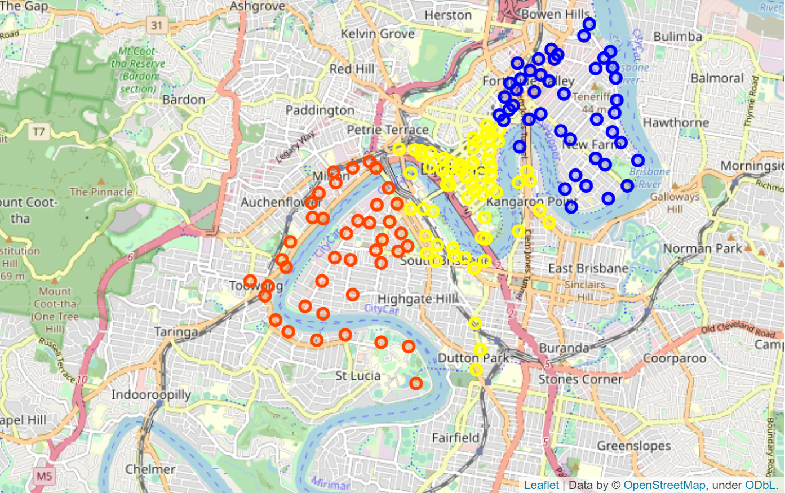

# SPARK K-MEANS CLUSTERING

L'objectif principal de ce projet est de proposer un k-means clustering de Bristol City Bike en fonction de l'emplacement des stations vélos en utilisant spark. Le fichier BRISBANE-city-bike.json  contient des informations concernant l’emplacement de chaque vélo.  
  
On souhaite obtenir un résultat de clustering comme suit:
 
